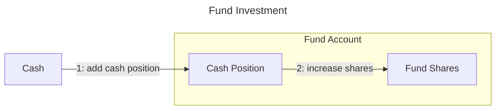
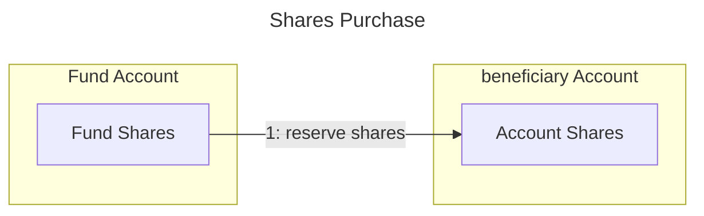
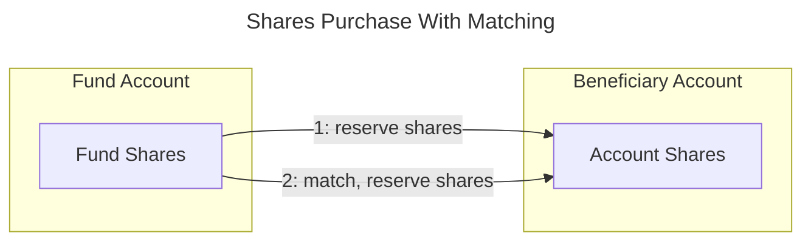
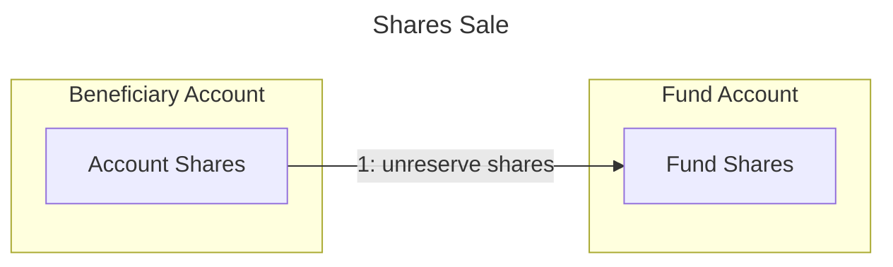
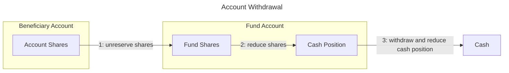
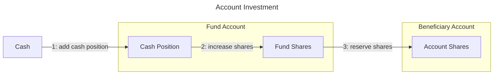

# Transactions

This document describes the types of transactions, their effects on the fund and beneficiary accounts.

## Accounts & Balances

### Fund Account

Each account has a balance of shares.
The Fund Account tracks a given investment trading account.
Its value flutuates with the market price of the investment.
Its shares do not change with the market price changes.

Note the distinction between fund shares (parts of the total fund value) and investment stock shares (parts of the detailed investements).

### Beneficiary Account

Each beneficiary account has a balance of fund shares, meaning they are part of the total fund value.

## Transaction Types

### Fund Investment

When deposits are made to the fund account, shares are added to the fund account balance using the current share price.
No changes to beneficiary accounts are made.

**NOTE - the order of the cash position increase and the shares increase is important as it affects the share price used to calculate the shares.**

The system allows for two variants of fund investment:
* with cash position already added
* adding a cash position

The normal use of the system will automatically add a cash position to the fund account - as the system updates the positions reading from the investment account.

**NOTE - as of now, the system does not detect automatically the cash position and adjust the fund share balance when the cash position is added.**

### Shares Purchase

Purchase transactions add shares to the beneficiary account balance using the current share price. 
The fund account is not affected by the beneficiary account's share price changes. 
Nevertheless the fund available shares are reduced by the number of shares added to the beneficiary account.

**NOTE - as of now, beneficiarys dont directly deposit cash to the fund account, only administrators can do that.**

### Shares Purchase With Matching

The system allows for matching shares purchase as an incentive to invest in the fund. When used a purchase transaction triggers a secondary purchase following the mathching rules.

The matching rules are:
* Each matching rule has a period of availability (start date and end date)
* Each matching rule has a matching ratio (e.g. 1:1, 1:2, 1:3, etc.)
* Each matching rule has a maximum amount of cash that can be purchased (e.g. 1000 USD)

Transactions may be annotated with flags to prevent matching.

### Shares Sale

Sale transactions sell shares from the beneficiary account balance using the current share price.
The fund account is not affected by the beneficiary account's share price changes. 
The fund available shares are increased by the number of shares sold from the beneficiary account.

**NOTE - This transaction does not usually make sense for beneficiarys, as they would rather withdraw cash from the fund account.**

### Account Withdrawal

Note that a withdrawal requires two transactions:
* a sale of shares from the beneficiary account which transfers or deallocates shares to the fund account
* a withdrawal of cash from the fund account which decreases the fund shares available

**NOTE - Withdrawals of shares with matching must be approved to avoid gamming the system.**
### Account Investment

Note that a deposit requires two transactions:
* a deposit of cash to the fund account which increases the fund shares available
* a purchase of shares from the beneficiary account which increases the beneficiary account shares

## Other Transaction Types

Other transaction types not yet implemented:
* Borrowing - allow beneficiaries to borrow cash from their account, reducing their shares, but tracking the debt
* Repayment - repay a loan, increasing their shares and decreasing the debt
